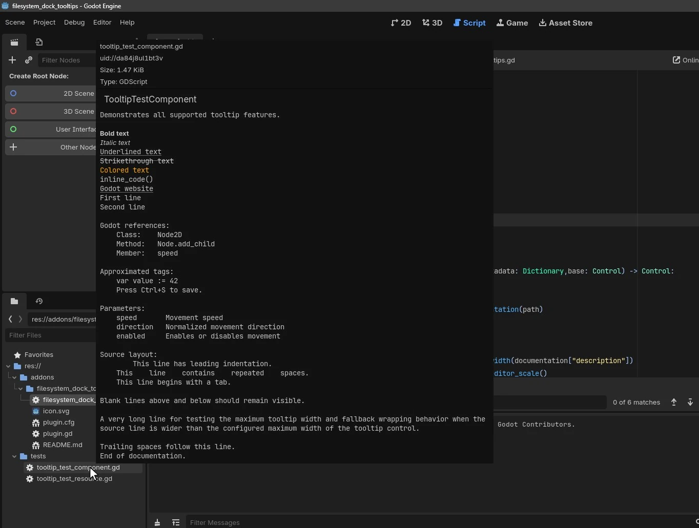

# FileSystem Script Documentation Tooltips

A Godot editor plugin that extends FileSystem tooltips for GDScript files
with `class_name` information and rendered `##` documentation.

## Features

- Displays the script's `class_name`
- Renders GDScript documentation comments
- Supports common BBCode-style documentation formatting
- Works directly in the Godot FileSystem dock
- No runtime dependency
- No network communication

## Installation

### Godot Asset Library

Install the plugin through the Godot Asset Library.

### Manual installation

Copy:

`addons/filesystem_dock_tooltips`

into your Godot project and enable the plugin under:

`Project Settings > Plugins`
